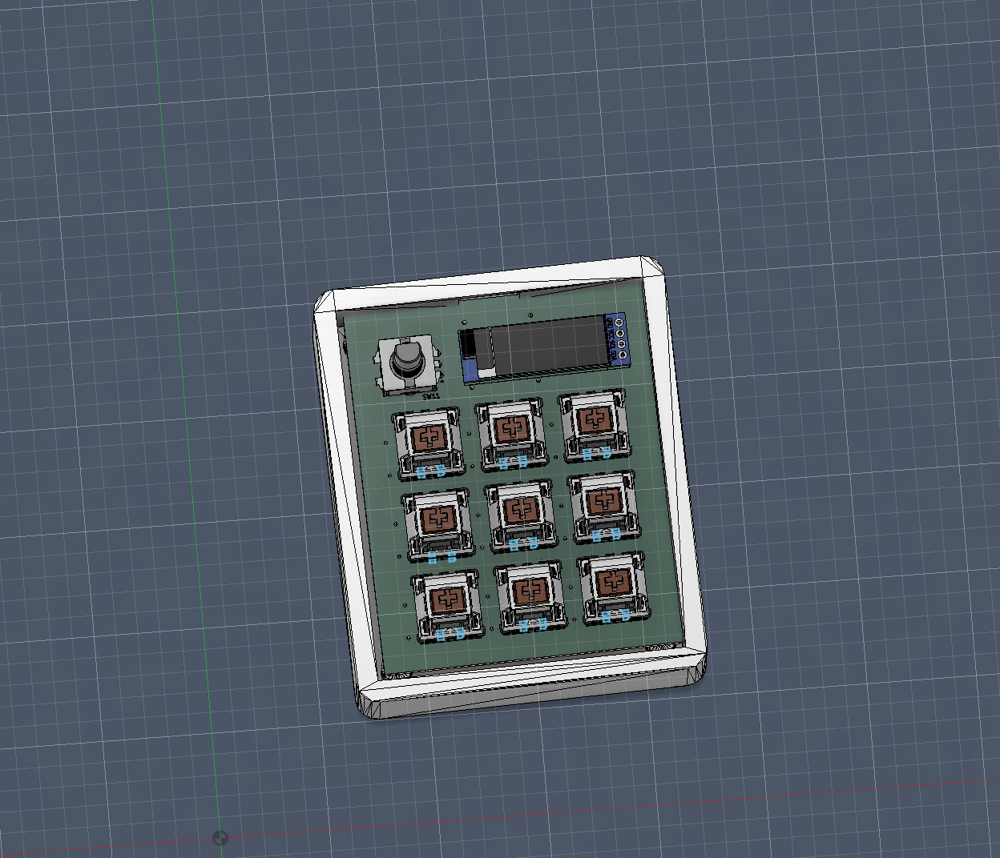
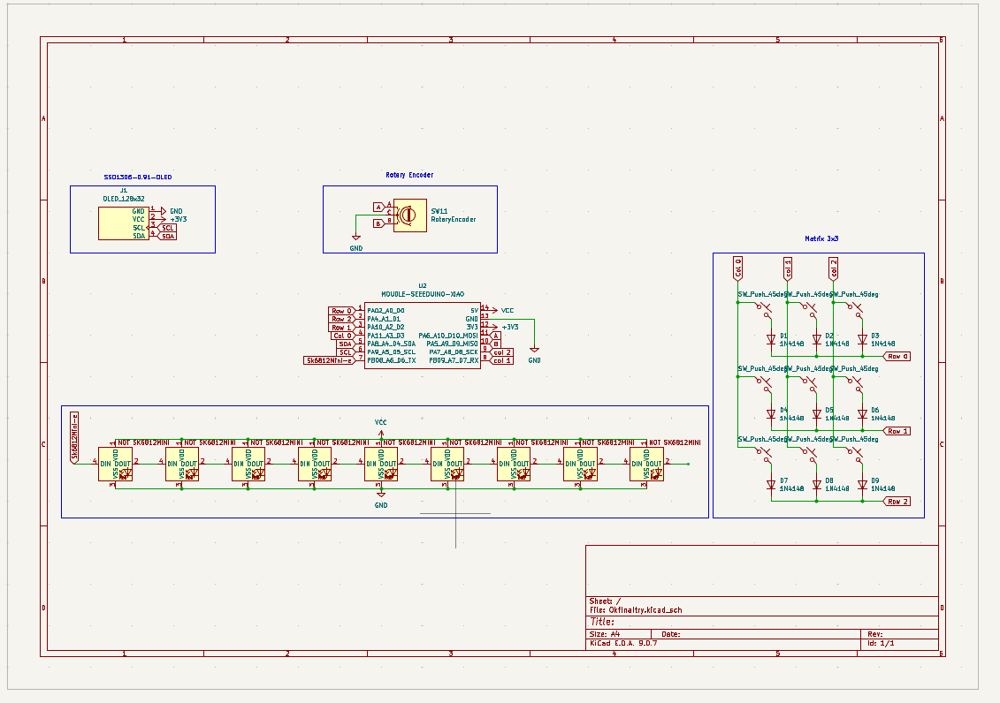
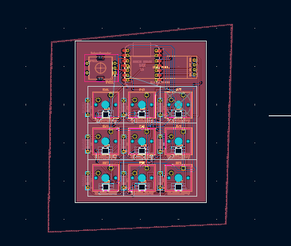

# SoumilHackpad

Blueprint hackpad project repository.

## Project Overview

- Hackpad name: SoumilHackpad
- Creator: soumilvyas1
- Description: Add your short project description here.

## Repository Structure

- `CAD/` - Full assembled hackpad model (`.STEP`, `.STP`, or `.3MF`)
- `PCB/` - PCB source design files (for KiCad: `.kicad_pro`, `.kicad_sch`, `.kicad_pcb`)
- `Firmware/` - Firmware source files (`QMK`, `KMK`, `ZMK`, etc.)
- `production/` - Manufacturing-ready outputs (gerbers, case exports, firmware build)

## Required Design Constraints

- Through-hole Seeed XIAO RP2040 as main MCU
- PCB size <= `100mm x 100mm`
- Case size <= `200mm x 200mm x 100mm`
- Fewer than 16 inputs total
- Approved parts only
- 2-layer PCB only
- 3D printed case parts only (no acrylic/laser-cut parts)

## Submission Checklist

### Source Files

- [ ] `CAD/assembly.step` (or `.stp` / `.3mf`) with PCB and all case parts
- [ ] `PCB/` source files are complete
- [ ] `Firmware/` source files are complete

### Production Files

- [ ] `production/gerbers.zip`
- [ ] `production/Top.step` (or `.stl`)
- [ ] `production/Bottom.step` (or `.stl`)
- [ ] `production/Middle.step` (or `.stl`) if used
- [ ] `production/firmware.uf2` (QMK) or `production/main.py` (KMK)

## Screenshots (Required)

### 1. Overall Hackpad



### 2. Schematic



### 3. PCB



### 4. Case Fit / Assembly

Case fit image not added yet.

## BOM

| Item | Qty | Part Number / Link | Notes |
| --- | --- | --- | --- |
| Seeed XIAO RP2040 (Through-hole) | 1 | TODO | Main MCU |
| Switches | TODO | TODO | |
| Keycaps | TODO | TODO | |
| Diodes | TODO | TODO | |
| Encoder (optional) | TODO | TODO | |
| OLED (optional) | TODO | TODO | |

## Ship Post Template

Post this in `#blueprint-drafts` on Slack:

```text
Hackpad name: SoumilHackpad
GitHub Repo: https://github.com/soumil210/SoumilHackpad
Description: <short description of your project>
```

Attach images of your hackpad with the post.

## Final Submission

1. Submit design review from the Blueprint dashboard.
2. Keep this repo up to date with any review feedback.
